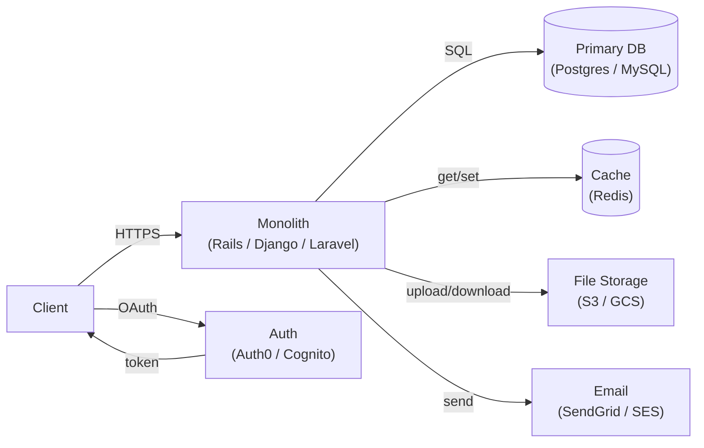
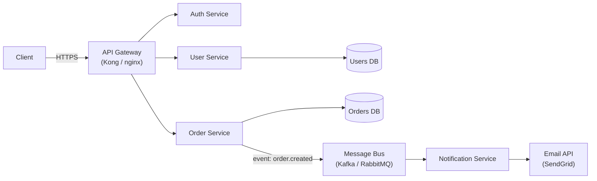
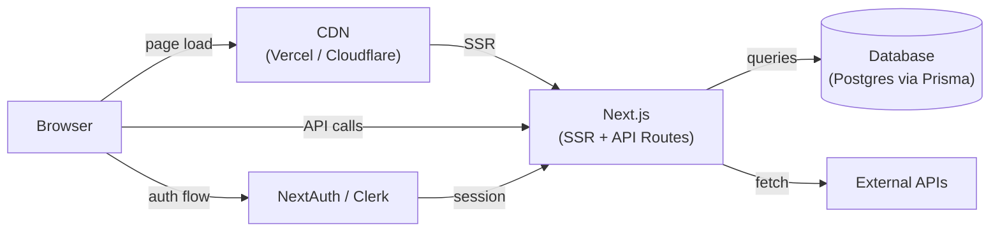
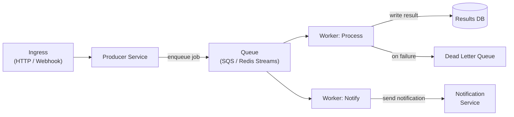
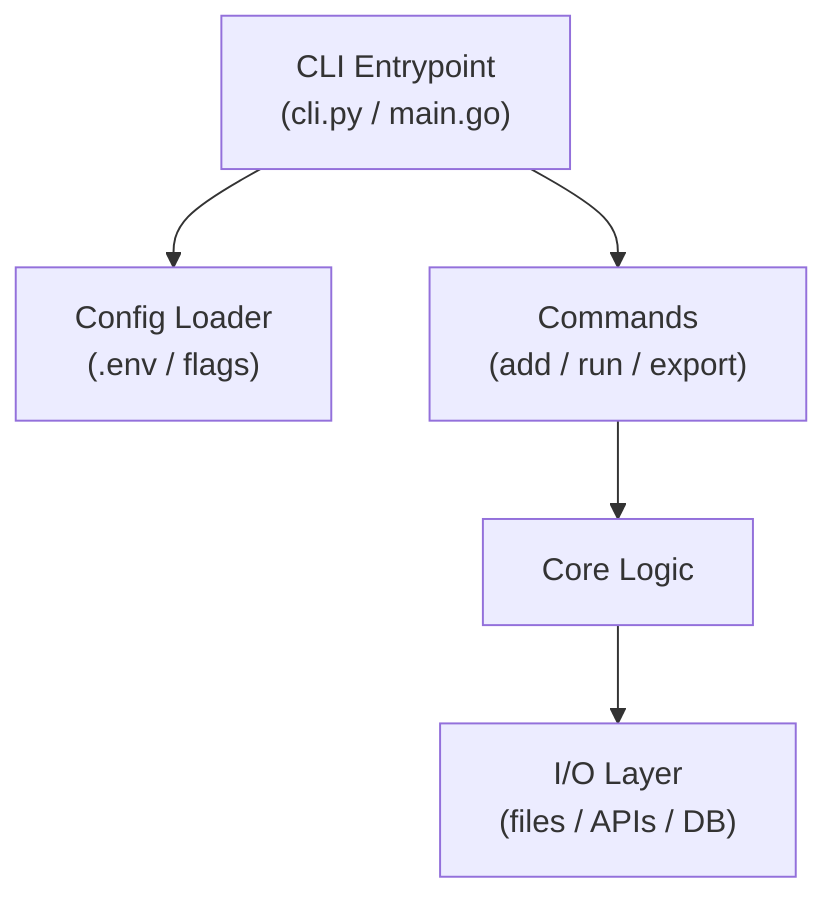
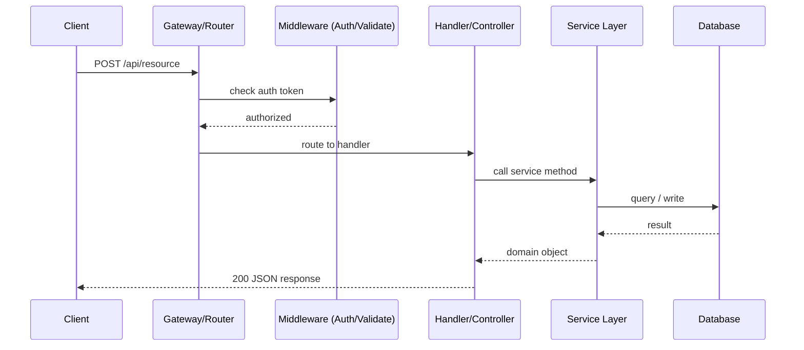

# Architecture Diagram Patterns

Use these Mermaid templates as starting points. Always adapt to what you actually find in the codebase.

---

## Monolith with External Services

---

## Microservices

---

## Next.js / Full-Stack Web App

---

## Event-Driven / Worker Architecture

---

## CLI Tool / Script Architecture

---

## Sequence Diagram: Typical API Request

